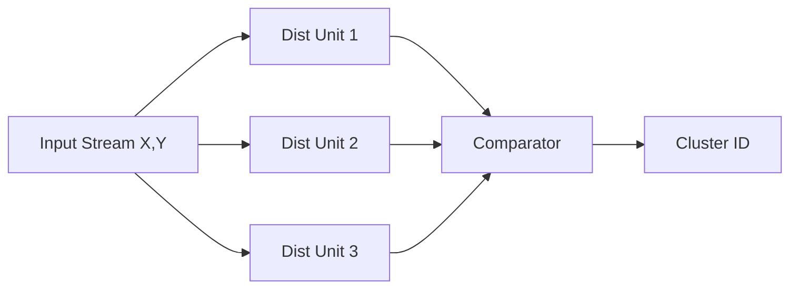

# Custom Hardware Accelerator for K-Means Clustering

## 📄 [Read the Full Technical Report (PDF)](docs/KMeans_Technical_Report.pdf)
*(Contains detailed Schematics, Waveforms, and Design Theory)*

---

## 🚀 Project Overview
This project implements a dedicated **Hardware Accelerator** for the K-Means clustering algorithm on an FPGA. Unlike general-purpose CPUs that process data sequentially, this design leverages **spatial parallelism** to calculate Euclidean distances for multiple centroids simultaneously.

**Key Features:**
* **Parallel Datapath:** Instantiates 3 parallel distance calculation units to achieve **1-cycle latency** per data point.
* **Fixed-Point Arithmetic:** Uses **Q8.8 format** (16-bit) to optimize area usage compared to floating-point implementations.
* **Hardware Optimization:** Replaces the computationally expensive Square Root operation with **Squared Euclidean Distance** comparison $(A^2 < B^2)$, saving ~400 LUTs.
* **Custom Arithmetic:** Includes a custom iterative `booth_multiplier.v` for arithmetic exploration (though standard DSP inference is used in the top module for throughput).

---

## 🛠 System Architecture

The system follows a synchronous dataflow architecture. Input data $(X, Y)$ is broadcast to all Distance Units, which compute costs in parallel. The Comparator determines the minimum cost and assigns the Cluster ID.

---

## 📊 Resource Utilization (Artix-7)
Synthesized using **Vivado 2025.1** for device `xc7a35tcpg236-1`.

| Resource Type | Used | Available | Utilization % |
| :--- | :--- | :--- | :--- |
| **Slice LUTs** (Logic) | 104 | 20,800 | **0.50%** |
| **DSP48E1** (Multipliers) | 6 | 90 | **6.67%** |
| **Registers** (Flip-Flops) | 3 | 41,600 | **<0.01%** |
| **Bonded IOB** (Pins) | 38 | 106 | 35.85% |

*Analysis:* The low LUT utilization (0.5%) indicates massive room for scalability. The design efficiently maps arithmetic to the FPGA's dedicated **DSP48 slices**, ensuring high-performance multiplication.

## 💻 How to Run (Vivado)
Create Project: Open Vivado and create a new RTL Project. Select the xc7a35tcpg236-1 part (or any Artix-7).

Add Sources: Add all files from the /src folder as Design Sources.

Add tb/tb_kmeans.v as the Simulation Source.

Run Simulation: Click Run Simulation > Run Behavioral Simulation.

Observe the cluster_result signal changing in the waveform viewer.

View Hardware:

Click Run Synthesis.

Open Elaborated Design > Schematic to see the parallel hardware structure.
